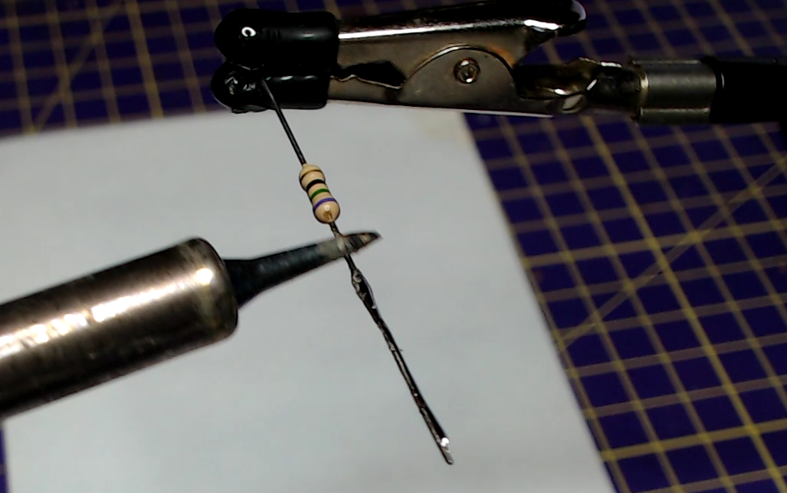

## جمع المكونات

سوف تحتاج:
+ 4 × أسلاك توصيل ذات مقبس، تشمل بشكل مثالي الأحمر والأخضر والأزرق والأسود
+ 3 ×مقاومات نفس القيمة، حوالي 70 أوم أو أكبر
+ 1 × متصل مضي ملون (RGB LED) مهبط مشترك
+ اللحام وأنابيب الانكماش الحراري
+ قاطعات أسلاك أو أدوات تقشير الأسلاك

## ابحث عن القطب الأحمر للمتصل RGB LED

يحتوي المتصل المضيء RGB LED ذو المهبط المشترك على قطب واحد أطول من البقية هو المهبط ويجب توصيله بالأرضي (GND). تحقق من مواصفات المتصل المضيء RGB LED الخاص بك ولكن ترتيب الأرجل عادة ما يكون أحمر، مهبط (أطول قطب)، أخضر، أزرق.

انشر أرجل المتصل المضيء LED بعناية، وقم بإمساك المتصل باستخدام أيدي المساعدة أو مشبك.

## لحام أقطاب المتصل المضيء LED بالقصدير

لكل قطب من أقطاب المتصل LED، استخدم كاوي اللحام بتسخينه لبضع ثوان، ثم قم بتطبيق اللحام بحيث يتم تغطية كل قطب بطبقة متساوية من اللحام.

--- no-print ---

--- /no-print ---

--- print-only ---

--- /print-only ---

## لحام المقاومات بالقصدير

كرر هذا الإجراء بكلٍ من قطبي المقاومات الثلاثة.

--- no-print ---

--- /no-print ---

--- print-only ---

--- /print-only ---
## لحام المقاومات مع أقطاب المتصل المضيء LED

أمسك قطب المقاومة على طول أحد أقطاب المصعد في المتصل المضيء LED.

ثم استخدم كاوي اللحام لتسخين كلا القطبين، بحيث يذوب اللحام ويترابطان معًا.

--- no-print ---

--- /no-print ---

--- print-only ---

--- /print-only ---

## كرر مع باقي الأقطاب

كرر هذا الإجراء لجميع أقطاب المتصل المضيء LED، باستثناء المهبط (أطول قطب).

## قم بتوصيل اسلاك التوصيل الأربعة

قطع أسلاك التوصيل بحسب الطول المطلوب وشريط حوالي 1 سم من العازل من نهاية الأسلاك.

غلف أسلاك التوصيل بالشرنك الحراري.

قم بقص النهايات المجردة لأسلاك التوصيل، ثم اربطها بأقطاب المتصل. إذا كان لديك سلك توصيل أسود، فيجب توصيله بالمهبط الخاص بالمتصل المضيء LED (أطول قطب).

--- no-print ---

 

--- /no-print ---

قم بتحريك الشرنك الحراري، بحيث يلتقي بقاعدة LED ويغطي المقاومات وجميع الوصلات الملحومة.

ثم استخدم حافة كاوي اللحام (وليس القصدير) وافركها برفق لأعلى ولأسفل مع الشرنك الحراري، مما يؤدي إلى تقلصه حول التوصيلات، وتوفير غطاء عازل.

--- no-print ---

 

--- /no-print ---

--- print-only ---

--- /print-only ---

بمجرد أن يتم تأمين جميع الأقسام الأربعة من الشرنك الحراري حول التوصيلات، يجب أن يكون لديك RGB LED مكتمل، وجاهز للاتصال مباشرة بأقطاب GPIO الخاصة بك.

