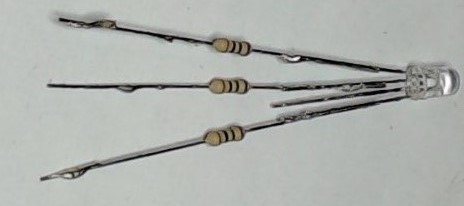
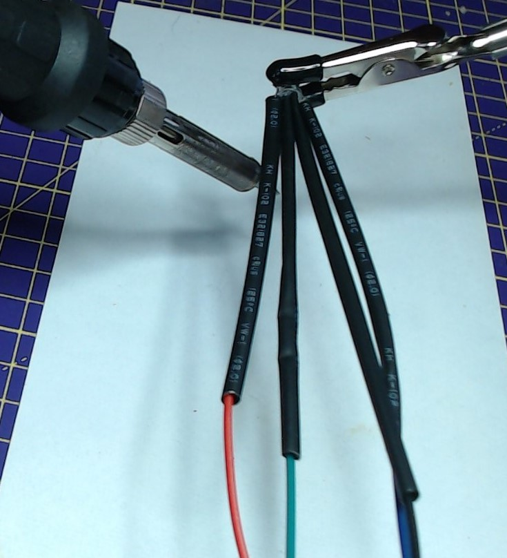

## Gather components

You will need:
+ 4 x socket-socket jumper wires, ideally including red, green and blue and black
+ 3 x same value resistors, around 70 Ohm or higher
+ 1 x common cathode RGB LED
+ Solder and heat shrink
+ wire cutters or strippers

## Find the red leg of the RGB LED

A common cathode RGB LED has one longer leg which is the cathode and needs to be connected to ground (GND). Check the specification for your RGB LED but the order of the legs is usually red, cathode (longer leg), green, blue.  

Carefully spread the legs of the LED, and secure the LED using a helping-hands or a bulldog clip.

## Tin the LED's legs

For each of the LED's legs, use a soldering iron to heat them for a few seconds, then apply solder so that each leg is coated with an even layer of solder.

--- no-print ---

--- /no-print ---

--- print-only ---

--- /print-only ---

## Tin the resistors

Repeat this procedure with both legs of the three resistors.

--- no-print ---

--- /no-print ---

--- print-only ---

--- /print-only ---
## Solder the resistors to the legs of the LED

Hold the leg of the resistor along side one of the anode legs of the LED.

Then use the soldering iron to heat both legs, so that the solder melts and they bond together.

--- no-print ---

--- /no-print ---

--- print-only ---

--- /print-only ---

## Repeat for the remaining legs

Repeat this procedure for all the LED legs, apart from the cathode (the longest leg).

## Attach the four jumper wires

Cut your jumper leads to your desired length and strip about 1cm of insulation from the end of the wires.

Sheath the jumper wires with heat shrink.

Tin the stripped ends of the jumper leads, then bond them to the legs of the LED. If you have a black jumper lead, it should be attached to the cathode of the LED (the longest leg).

--- no-print ---

--- /no-print ---

Move the heat shrink up, so that it meets the base of the LED and covers the resistors and all the soldered joints.

Then use the edge of the soldering iron (not the tip) and gently rub it up and down the heat shrink, causing it to shrink around the joints, and provide an insulated covering.

--- no-print ---

--- /no-print ---

--- print-only ---

--- /print-only ---

Once all four sections of heat shrink have been secured around the joints, you should have your completed RGB LED, ready to connect directly to your GPIO pins.

