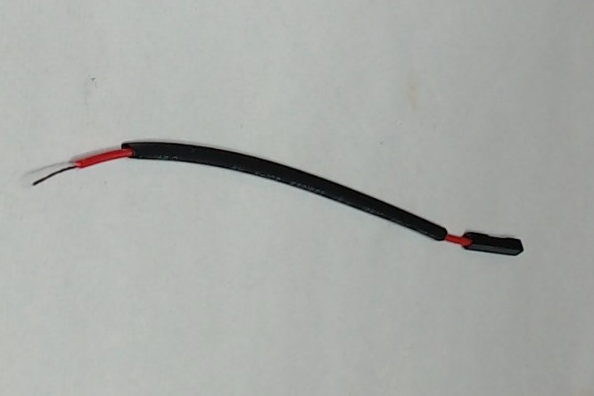
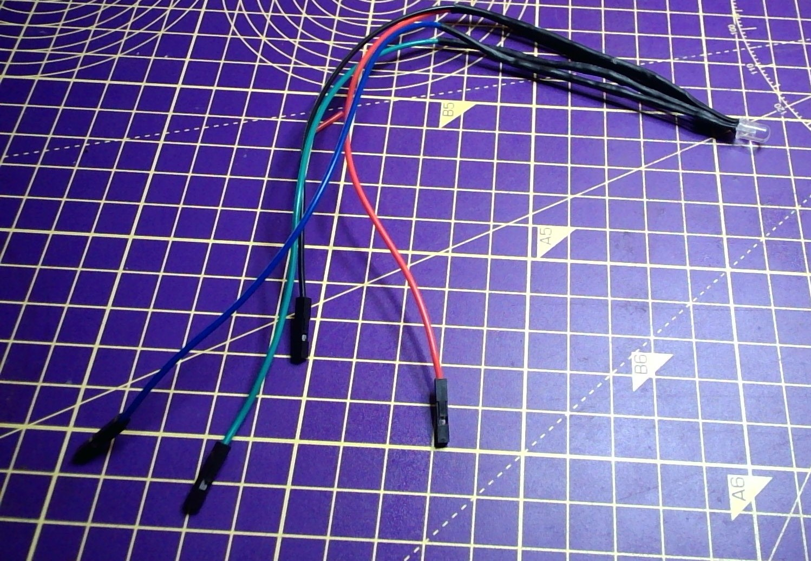

## Rassembler les composants

Tu auras besoin de :
+ 4 x fils de liaison prise-prise, comprenant idéalement un rouge, un vert, un bleu et un noir
+ 3 x résistances de même valeur, environ 70 Ohm ou plus
+ 1 x LED RVB à cathode commune
+ De la soudure et gaine thermorétractable
+ coupe-fils ou dénudeurs

## Trouver la patte rouge de la LED RVB

Une LED RVB à cathode commune a une patte plus longue qui est la cathode et doit être connectée à la terre (GND). Vérifie les spécifications de ta LED RVB, mais l'ordre des pattes est généralement rouge, cathode (patte plus longue), vert, bleu.

Écarte soigneusement les pattes de la LED et fixe la LED à l'aide d'un coup de main à souder ou d'une pince à dessin.

## Étamer les pattes de la LED

Pour chacune des pattes de la LED, utilise un fer à souder pour les chauffer pendant quelques secondes, puis applique de la soudure afin que chaque patte soit recouverte d'une couche uniforme de soudure.

--- no-print ---

--- /no-print ---

--- print-only ---

--- /print-only ---

## Étamer les résistances

Répète cette procédure avec les deux pattes des trois résistances.

--- no-print ---

--- /no-print ---

--- print-only ---

--- /print-only ---
## Souder les résistances aux pattes de la LED

Maintiens la patte de la résistance le long de l'une des pattes d'anode de la LED.

Ensuite, utilise le fer à souder pour chauffer les deux pattes, afin que la soudure fonde et qu'elles se lient.

--- no-print ---

--- /no-print ---

--- print-only ---

--- /print-only ---

## Répéter l'opération pour les pattes restantes

Répète cette procédure pour toutes les pattes de la LED, à l'exception de la cathode (la patte la plus longue).

## Fixer les quatre câbles de liaison

Coupe tes câbles de liaison à la longueur souhaitée et dénude environ 1 cm d'isolant à l'extrémité des fils.

Gaine les câbles avec une gaine thermorétractable.

Étame les extrémités dénudées des fils de liaison, puis colle-les aux pattes de la LED. Si tu as une connexion noire, elle doit être attaché à la cathode de la LED (la patte la plus longue).

--- no-print ---

 

--- /no-print ---

Déplace la gaine thermorétractable vers le haut, de sorte qu'elle rencontre la base de la LED et recouvre les résistances et tous les joints soudés.

Ensuite, utilise le bord du fer à souder (pas la pointe) et frotte-le doucement de haut en bas sur la gaine thermorétractable, cela fera rétrécir la gaine autour des joints et fournira une couverture isolante.

--- no-print ---

 

--- /no-print ---

--- print-only ---

--- /print-only ---

Une fois que les quatre sections de gaine thermorétractable ont été fixées autour des joints, tu devrais avoir ta LED RVB terminée, prête à être connectée directement à tes broches GPIO.

