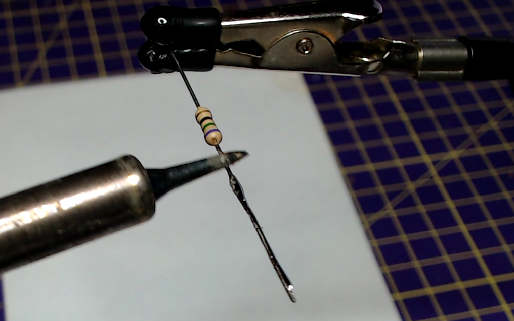
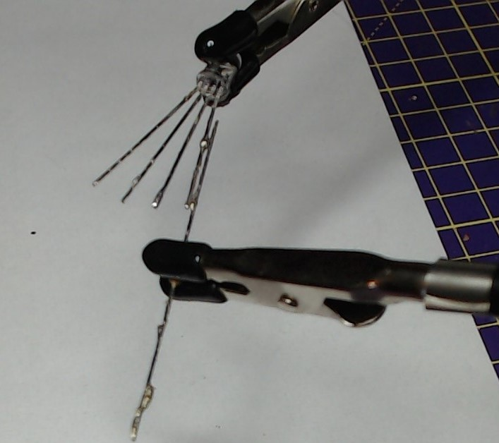
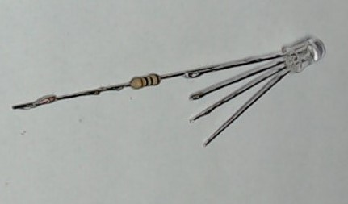
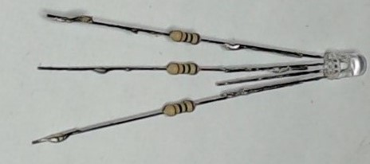
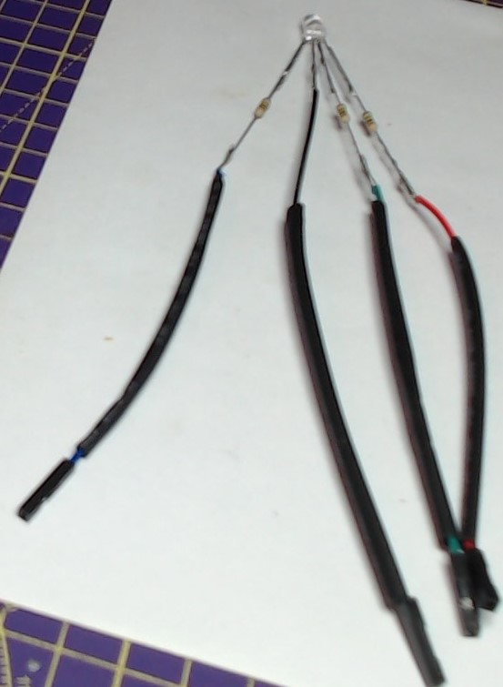

## Verzamel onderdelen

Je hebt nodig:
+ 4 x bus-bus jumperdraden, liefst ook rood, groen en blauw
+ 3 weerstanden van dezelfde waarde, ongeveer 70 Ohm of hoger
+ 1× RGB-led met gemeenschappelijke kathode
+ Soldeerbout en krimpkous
+ tang om draad te knippen of te strippen

## Zoek de rode poot van de RGB-led

Een gewone kathode RGB-led heeft één langere poot, de kathode en moet worden aangesloten op aarde (GND). Controleer de specificatie van je RGB-led, maar de volgorde van de poten is meestal rood, kathode (langere poot), groen, blauw.

Spreid de pootjes van de LED voorzichtig uit en zet de LED vast met behulp van een soldeerhulp of een krokodillenklem.

## Vertin de poten van de LED

Gebruik voor elk van de led-poten een soldeerbout om ze een paar seconden te verwarmen en breng vervolgens soldeer aan zodat elke poot is bedekt met een gelijkmatige laag soldeer.

--- no-print ---

--- /no-print ---

--- print-only ---

--- /print-only ---

## Vertin de weerstanden

Herhaal deze procedure met alle draden van de drie weerstanden.

--- no-print ---

--- /no-print ---

--- print-only ---

--- /print-only ---
## Soldeer de weerstanden aan de pootjes van de LED

Houd de draad van de weerstand naast een van de anode-pootjes van de LED.

Gebruik vervolgens de soldeerbout om beide pootjes te verwarmen, zodat het soldeer smelt en ze aan elkaar hechten.

--- no-print ---

--- /no-print ---

--- print-only ---

--- /print-only ---

## Herhaal dit voor de overige pootjes

Herhaal deze procedure voor alle LED-poten, behalve de kathode (de langste poot).

## Bevestig de vier jumperdraden

Knip je jumperdraden op de gewenste lengte en strip ongeveer 1 cm isolatie van het uiteinde van de draden.

Omhul de jumperdraden met de krimpkous.

Vertin de gestripte uiteinden van de jumperdraden en plak ze vervolgens vast aan de pootjes van de LED. Als je een zwarte jumperdraad hebt, moet deze worden bevestigd aan de kathode van de LED (het langste been).

--- no-print ---

 

--- /no-print ---

Schuif de krimpkous omhoog, zodat deze de basis van de LED raakt en de weerstanden en alle soldeerverbindingen bedekt.

Gebruik vervolgens de rand van de soldeerbout (niet de punt) en wrijf deze zachtjes op en neer over de krimpkous, waardoor deze rond de verbindingen krimpt en voor een geïsoleerde afdekking zorgt.

--- no-print ---

 

--- /no-print ---

--- print-only ---

--- /print-only ---

Zodra alle vier delen van de krimpkous rond de verbindingen zijn bevestigd is je voltooide RGB-LED klaar om rechtstreeks op je GPIO-pinnen aan te sluiten.

